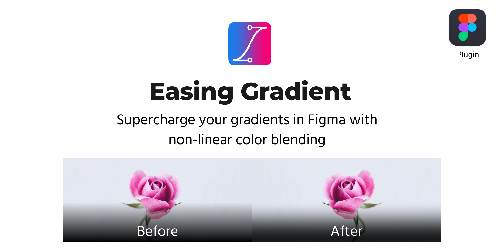

<p align="center"></p>

---

> ⚠️ This project is archived in favor of the much more feature-rich alternative, [alexwidua/figma-easing-gradients](https://github.com/alexwidua/figma-easing-gradients) ✨

## 🚀 Getting Started

1. On a Figma document, select a shape with a gradient
1. Go to _Plugins > Easing Gradient_
1. Watch your gradient become smooth and beautiful

## 🔧 Development

1. Install dependencies

   ```sh
   npm install
   ```

1. Build the plugin

   ```sh
   npm run dev
   ```

1. In Figma, go to _Plugins > Manage Plugins_
1. Click the **+** icon beside "Development"
1. Provide Figma with `manifest.json` at the root of the repo

## 💭 Inspired By

Please check out these previous works that inspired the creation of figma-easing-gradient. 🙏

- **[Easing Linear Gradients](https://css-tricks.com/easing-linear-gradients/)** - Andreas Larsen's wonderful write-up on easing gradients.

- **[larsenwork/sketch-easing-gradient](https://github.com/larsenwork/sketch-easing-gradient)** - A similar plugin for Sketch.

- **[larsenwork/postcss-easing-gradients](https://github.com/larsenwork/postcss-easing-gradients)** - A PostCSS plugin for achieving similar gradients.

## 📝 License

Copyright © 2019-present, [Matan Kushner](https://github.com/matchai).<br>
This project is [ISC](./LICENSE) licensed.
